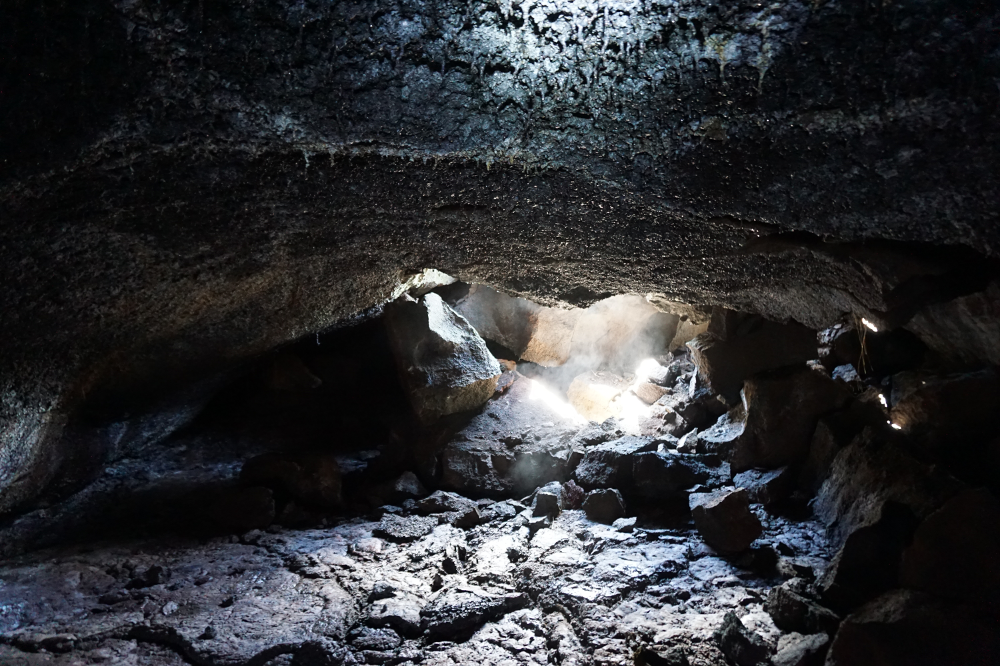

## Welcome to the Saw Microbial Diversity Lab at the George Washington University!

We are interested in diversity, ecology, and evolution of microbes in extreme habitats such as hot springs, hydrothermal vents, caves, and also habitats that are least explored/studied.
Diversity, Ecology, and Evolution are intricately tied together in biology and we are interested in how these are influencing each other in microbial communities and how co-evolution of microbes take place.

Specifically, we aim to:
- understand how unique assemblage of microorganisms arise in extreme habitats
- explore functional diversity of microbial community in extreme habitats and evolutionary processes driving their diversity
- investigate evolutionary significances of major microbial groups
- cultivate previously uncultivated archaea and bacteria from various habitats
