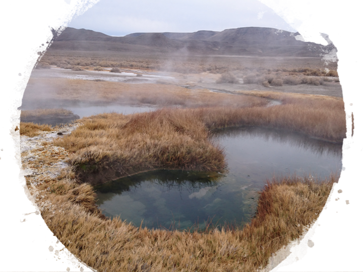

## Welcome to the *Saw* Microbial Diversity Lab at the George Washington University!

We are interested in diversity, ecology, and evolution of microbes in extreme habitats such as hot springs and hydrothermal vents and also habitats that are least explored/studied. 
Diversity, Ecology, and Evolution are intricately tied together in biology and we are interested in how microbial diversity, ecology, and evolution are influencing each other.

Specifically, we aim to:
- understand how unique assemblage of microorganisms arise in extreme habitats
- explore functional diversity of microbial community in extreme habitats and evolutionary processes driving their diversity
- investigate evolutionary significances of major microbial groups
- cultivate previously uncultivated archaea and bacteria from various habitats

## Latest news

We are excited to welcome Manolya Balbay as a PhD student to GWU PhD program in Biological Sciences. She will be joining the lab in Fall 2019. Welcome, Manolya!

We are also excited to have Sarah Schmoyer and Saleh Naeem to our lab. Both are undergraduate students at GWU. Welcome, Sarah and Saleh!
