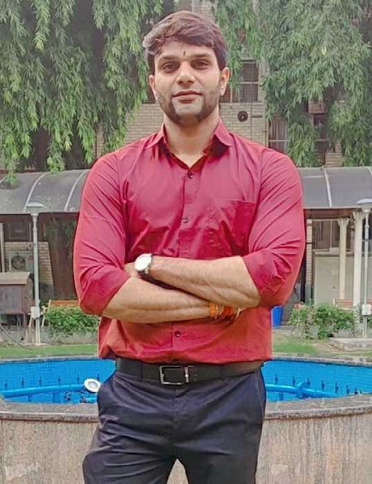
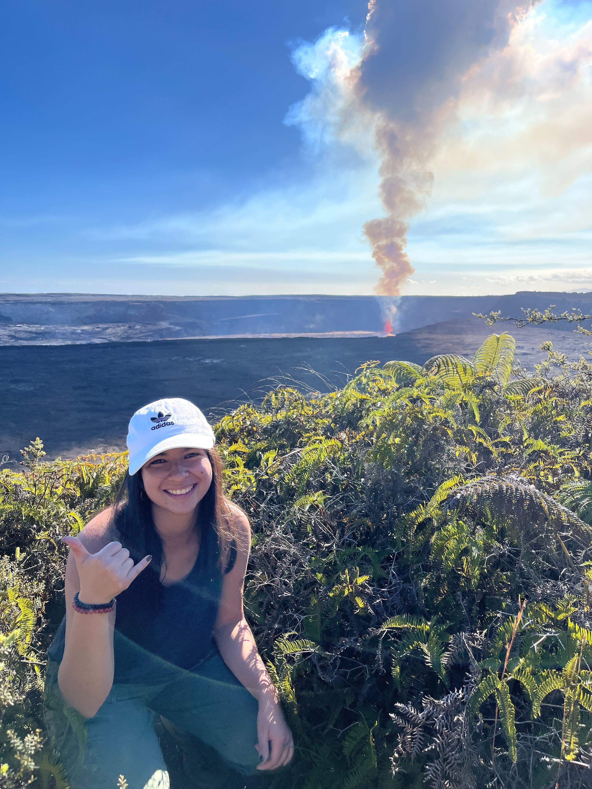
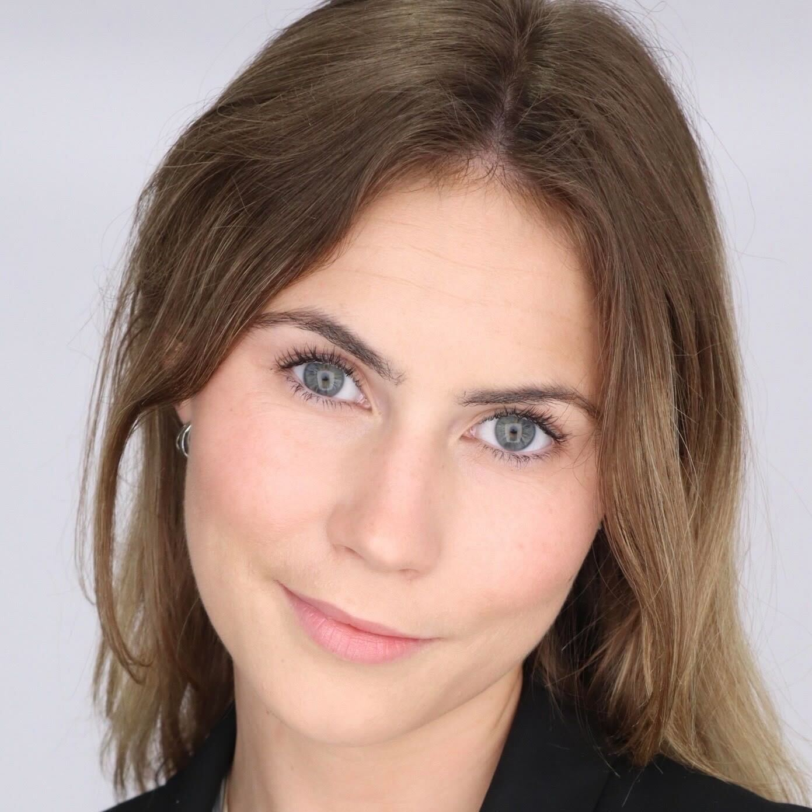
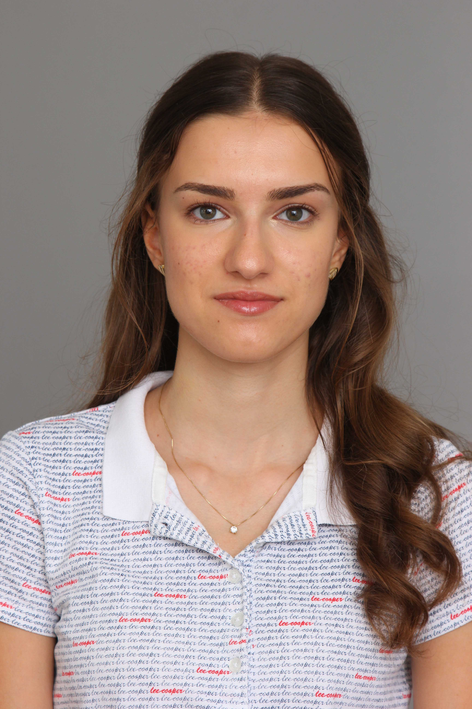

## Current Lab members

### Jimmy Saw (Principle Investigator)

Hi, everyone! I am fascinated by microbes and their diversity! I attended the University of Hawaiʻi at Mānoa from undergraduate through Ph.D. years and I worked with Stuart Donachie for my Ph.D. degree on cultivation and complete genome sequencing of *Gloeobacter kilaueensis* JS1.
I then did postdoctoral research on archaeal diversity and evolution with Thijs Ettema at Uppsala University in Sweden from 2012 to 2016 where we discovered the Lokiarchaeota and Asgardarchaeota, then did another postdoctoral research on SAR11 and SAR202 pangenomics with Steve Giovannoni at Oregon State University from 2016 to 2018.
You can also check out my [Google Scholar](https://scholar.google.com/citations?user=9Vx-JTgAAAAJ&hl=en&oi=ao), [ORCID](https://orcid.org/0000-0001-8353-3854), and [Publons](https://publons.com/researcher/1441615/jimmy-saw/) pages.

### Shekhar Nagar (Postdoctoral researcher)

Exploring the functional dynamics of metagenome-assembled genomes in Hydrothermal steam vents and hot springs.

&nbsp;
&nbsp;

### Lausanne Oliver (2nd year PhD student)

Working on characterization of archaeal and viral communities inhabiting hot springs using both cultivation independent and dependent based methods.

&nbsp;
&nbsp;

### Abby Clark (BS/MS student)

&nbsp;
&nbsp;

### Adeline Monks (Senior Undergraduate Student)

Hi! I am a senior undergraduate student majoring in Cellular and Molecular Biology with minors in Chemistry and Fine Arts at GW. In the Saw Lab, I am researching cyanobacteria steam vent biofilms collected in 2019. I am working on enriching and isolating cultures in order to sequence and analyze the metagenomic data of these early-evolving lineages. I am doing a combination of wet and dry lab work with the Saw team. In my free time, I am a yoga instructor and trying to become a green thumb!

&nbsp;
&nbsp;

### Zhihe Zhong (Junior Undergraduate Student)

Working on the cultivation of microbes and cave microbes.

&nbsp;
&nbsp;

### Katherine McNicholas (Sophomore Undergraduate Student)

### Stanislava Dinkova (Sophomore Undergraduate Student)

My name is Stanislava Dinkova, and I'm a sophomore studying Molecular and Cellular Biology with a minor in Bioinformatics here at GWU. I am currently exploring different fields of biology through my classes, but I am mostly curious about gene expression mechanisms, how they work and differ in prokaryotic and eukaryotic organisms and how we can relate those to fighting viruses. Another topic that I am passionate about but haven't gotten the chance to explore as much is cancer mechanisms and treatments. In Dr. Saw's lab I will be focusing on the Bioinformatics side in terms of reading and sorting out hot spring metagenomic data.

&nbsp;
&nbsp;

### Jack (dogtoral researcher)

Researching how to specialize and finetune olfactory receptors to maximize nutrient acquisition.

&nbsp;
&nbsp;

## Lab alumni

  - Pia Sen (PhD student)
  - Manolya Gul Balbay (PhD student)
  - May May Hubbard (undergrad)
  - Sam Lee (undergrad)
  - Chengxuan Zhang (MS student)
  - Mona Hajjar (undergrad)
  - Christina Pavloudi (postdoc)
  - Max Shlafstein (undergrad)
  - Chloe Shaw (BS/MS student)
  - Brooke Cody (undergrad)
  - Alison Pagalilauan (BS/MS student)
  - Kaitlynn Slattery (undergrad)
  - Guin Lissner (undergrad)
  - Natalia Monsalve (undergrad)
  - Keerthi Selvam (high school student)
  - Saleh Naeem (undergrad)
  - Sarah Schmoyer (undergrad)
  - Talia Shapiro (undergrad)
  - Haley Quinn (undergrad)
  - Henry Becker (undergrad)
  - Maria Izzi (high school student)
