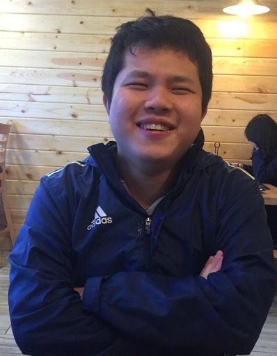

## Current Lab members

### Alison Pagalilauan (BS/MS student)

Hello! I am a senior at GW majoring in cellular and molecular biology and minoring in STEM teaching. When I'm not researching microbial diversity, you can find me working as a clinical assistant at Curative Inc., a COVID-19 detection lab. I hope to pursue graduate school and refine my research interests which include host-microbe interactions, ecological evolutionary development, and genetic bases of eusociality. In my free time, I enjoy trying new recipes and biking around DC.

### Chengxuan Zhang (MS student)

Hi, This is Chengxuan Zhang (张承瑄). I received my BS in Biology from Purdue University and I am currently an MS student at GW. My research focus now is microbiology and bioinformatics. I studied plant pathology and soil microbiology of tomatoes during my undergraduate studies. My dream research goal is to assemble genetically modified organisms that can synthesize L-glucose, an indigestible replacement of dietary dextrose. I was born in Beijing, but have spent most of my life time studying in the US. I love music and poetry, as well as cooking. Another interest of mine is travelling to places far away from civilization, such as mountains and deserts. 

### Jimmy Saw (Principle Investigator)

Hi, everyone! I am fascinated by microbes and their diversity! I attended the University of Hawaiʻi at Mānoa from undergraduate through Ph.D. years and I worked with Stuart Donachie for my Ph.D. degree on cultivation and complete genome sequencing of *Gloeobacter kilaueensis* JS1.
I then did postdoctoral research on archaeal diversity and evolution with Thijs Ettema at Uppsala University in Sweden from 2012 to 2016 where we discovered the Lokiarchaeota and Asgardarchaeota, then did another postdoctoral research on SAR11 and SAR202 pangenomics with Steve Giovannoni at Oregon State University from 2016 to 2018.
You can also check out my [Google Scholar](https://scholar.google.com/citations?user=9Vx-JTgAAAAJ&hl=en&oi=ao), [ORCID](https://orcid.org/0000-0001-8353-3854), and [Publons](https://publons.com/researcher/1441615/jimmy-saw/) pages.

### Manolya Balbay (PhD student)

I am from Turkey. I received my bachelor's degree from the Department of Molecular Biology and Genetics at Istanbul University in Turkey and my master's degree from the Munich Graduate School for Evolution, Ecology and Systematics at the Ludwig-Maximilians-University of Munich in Germany. I am currently a PhD student in the Department of Biological Sciences at the George Washington University. My research interests are focused on microbial genome evolution, evolutionary ecology of microbial populations, biogeochemical nutrient cycles, co-evolution of the biosphere and the geosphere, geomicrobiology, the origin and evolution of life on Earth and astrobiology. I also have a particular fascination with bacterial and archaeal species living in extreme environments, such as hydrothermal vents, geothermal hot springs, volcanoes, hypersaline lakes, deserts, Antarctic ice and the deep subsurface. My PhD research aims to discover novel microorganisms and functional pathways, characterize microbial activity, gain insights into the physiological adaptation and survival of microbial communities, and decipher microbe-mineral interactions in extreme environments considered as potential analogs for habitable zones on other planets and moons in order to expand our understanding of the origin, distribution, and evolution of life in the solar system/universe. My hobbies include hiking, visiting museums and ancient cities, and reading archaeology and history magazines.

### Max Shlafstein (undergraduate student)

Hello everyone! I am currently a senior at GW majoring in biology and minoring in both human anatomy and chemistry. I have become fascinated with metagenomics and genome assembly as tools to visualize microbial ecology of unique environments. I hope to utilize these tools to reveal evolutionarily significant microbial lineages within these communities. I am also a pre-med student and plan to work as an EMT during my gap year. When I’m not in classes I enjoy playing tennis and trying food from around DC!

### Sam Lee (undergraduate student)

Hello, I am a current junior studying biology at GWU. Following off previous research experience working with microbes on circadian activity, I hope to continue to investigate the microbial world and discover new microbes and microbial attributes that may significantly influence human life. I am extremely interested in the relationships between humans and the microorganisms that live on, inside, and around humans. Outside of the lab and school, I enjoy learning new languages and reading novels. After my bachelor’s degree, I hope to continue learning and pursuing higher level study in biology.

## Lab alumni

  - Natalia Monsalve
  - Saleh Naeem
  - Sarah Schmoyer
  - Talia Shapiro
  - Haley Quinn
  - Henry Becker
  - Maria Izzi
