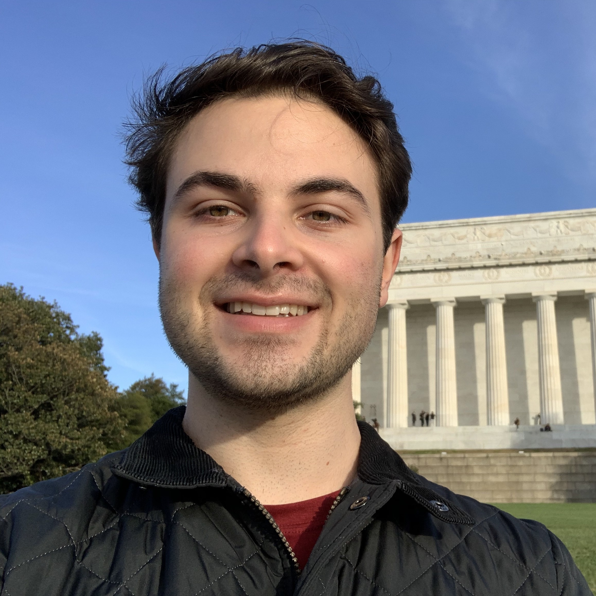
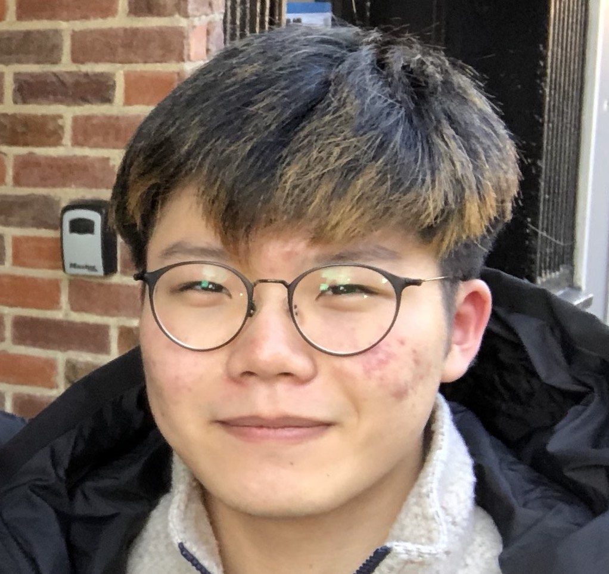
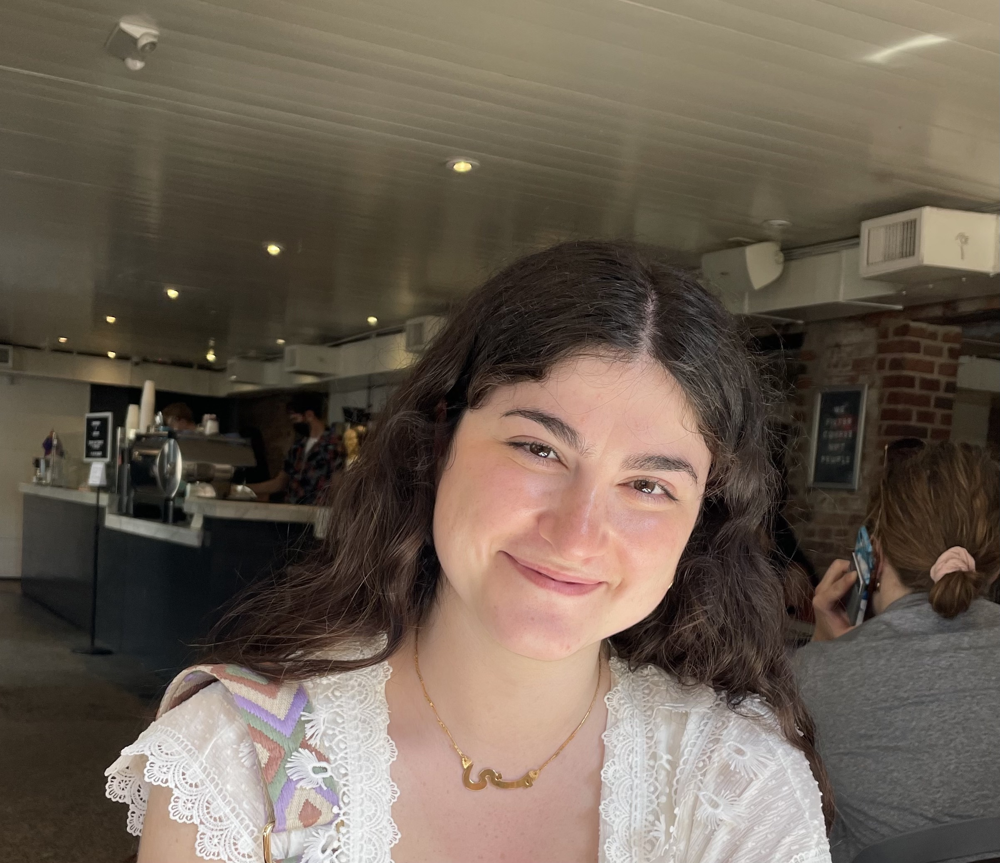

## Current Lab members

### Jimmy Saw (Principle Investigator)

Hi, everyone! I am fascinated by microbes and their diversity! I attended the University of Hawaiʻi at Mānoa from undergraduate through Ph.D. years and I worked with Stuart Donachie for my Ph.D. degree on cultivation and complete genome sequencing of *Gloeobacter kilaueensis* JS1.
I then did postdoctoral research on archaeal diversity and evolution with Thijs Ettema at Uppsala University in Sweden from 2012 to 2016 where we discovered the Lokiarchaeota and Asgardarchaeota, then did another postdoctoral research on SAR11 and SAR202 pangenomics with Steve Giovannoni at Oregon State University from 2016 to 2018.
You can also check out my [Google Scholar](https://scholar.google.com/citations?user=9Vx-JTgAAAAJ&hl=en&oi=ao), [ORCID](https://orcid.org/0000-0001-8353-3854), and [Publons](https://publons.com/researcher/1441615/jimmy-saw/) pages.

### Christina Pavloudi (Postdoctoral Researcher)

Working on microbial ecology and diversity in various extreme habitats.

&nbsp;
&nbsp;

### Manolya Balbay (PhD student)

Working on archaeal diversity and genomics.

&nbsp;
&nbsp;

### Pia Sen (PhD student)

Working on microbial diversity and the roles of viruses in extreme environments.

&nbsp;
&nbsp;

### Chengxuan Zhang (MS student)

Working on metagenomics of novel *Actinobacteria* from Hawaiian steam vents.

&nbsp;
&nbsp;

### Lausanne Oliver (BS/MS student)

Working on cultivation of microbes from various environmental samples.

&nbsp;
&nbsp;

### Chloe Shaw (BS/MS student - co-supervised by Courtney Smith)

Working on Bald Sea Urchin Disease and their microbiomes.

&nbsp;
&nbsp;

### Max Shlafstein (postbac student)

Working on microbial diversity and metagenomics.

&nbsp;
&nbsp;

### Sam Lee (undergraduate student)

Working on metagenomics and targeted cultivation of novel *Chloroflexi* lineages from Hawaiian steam vents.

&nbsp;
&nbsp;

### Mona Hajjar (undergraduate student)

Working on targeted cultivation of novel *Actinobacteria* from Hawaiian steam vents

&nbsp;
&nbsp;

### Jack (dogtoral researcher)

Researching how to specialize and finetune olfactory receptors to maximize nutrient acquisition.

&nbsp;
&nbsp;

## Lab alumni

  - Alison Pagalilauan
  - Kaitlynn Slattery
  - Guin Lissner
  - Natalia Monsalve
  - Saleh Naeem
  - Sarah Schmoyer
  - Talia Shapiro
  - Haley Quinn
  - Henry Becker
  - Maria Izzi
