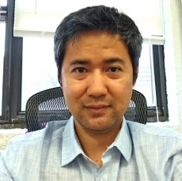

## Lab members

### Jimmy Saw (Principle Investigator)

Hi, everyone! I am fascinated by microbes and their diversity! I attended the University of Hawaiʻi at Mānoa from undergraduate through Ph.D. years and I worked with Stuart Donachie for my Ph.D. degree on cultivation and complete genome sequencing of *Gloeobacter kilaueensis* JS1.
I then did postdoctoral research on archaeal diversity and evolution with Thijs Ettema at Uppsala University in Sweden from 2012 to 2016 where we discovered the Lokiarchaeota and Asgardarchaeota, then did another postdoctoral research on SAR11 and SAR202 pangenomics with Steve Giovannoni at Oregon State University from 2016 to 2018.
I am originally from Myanmar (Burma) but I have lived in various places around the world. Some of the places I have lived in are: Singapore, Hawaiʻi, New Mexico, Oregon, and Sweden. I love to travel, hike, go on roadtrips, try new food, and cook new dishes.
You can also check out my [Google Scholar](https://scholar.google.com/citations?user=9Vx-JTgAAAAJ&hl=en&oi=ao), [ORCID](https://orcid.org/0000-0001-8353-3854), and [Publons](https://publons.com/researcher/1441615/jimmy-saw/) pages.

### Manolya Balbay (PhD student)

I am from Turkey. I received my bachelor's degree from the Department of Molecular Biology and Genetics at Istanbul University in Turkey and my master's degree from the Munich Graduate School for Evolution, Ecology and Systematics at the Ludwig-Maximilians-University of Munich in Germany. I am currently a PhD student in the Department of Biological Sciences at the George Washington University. My research interests are focused on microbial genome evolution, evolutionary ecology of microbial populations, biogeochemical nutrient cycles, co-evolution of the biosphere and the geosphere, geomicrobiology, the origin and evolution of life on Earth and astrobiology. I also have a particular fascination with bacterial and archaeal species living in extreme environments, such as hydrothermal vents, geothermal hot springs, volcanoes, hypersaline lakes, deserts, Antarctic ice and the deep subsurface. My PhD research aims to discover novel microorganisms and functional pathways, characterize microbial activity, gain insights into the physiological adaptation and survival of microbial communities, and decipher microbe-mineral interactions in extreme environments considered as potential analogs for habitable zones on other planets and moons in order to expand our understanding of the origin, distribution, and evolution of life in the solar system/universe. My hobbies include hiking, visiting museums and ancient cities, and reading archaeology and history magazines.

### Saleh Naeem (Undergraduate student)

My name is Saleh Naeem and I am a junior, majoring in biology and currently on the pre-med track. I am originally from Pakistan and really excited to indulge myself in the microbial diversity research this year with Professor Saw. My interest in this research specifically involves computation analysis based on the microbial ecology databases that are accessible online.  During my free time, I like to go to the gym and try to keep myself mentally as well as physically fit. 

### Sarah Schmoyer (Undergraduate student)

Sarah Schmoyer is a freshman from Hillsdale, NJ studying biology and international affairs. She first got involved with research in high school and later worked in a microbiology lab. She is looking forward to learning more about lab work, research, and microbiology.

