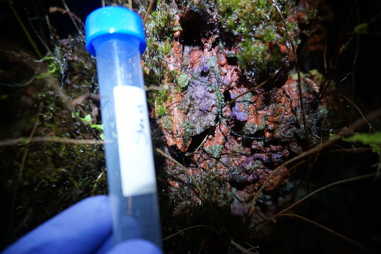
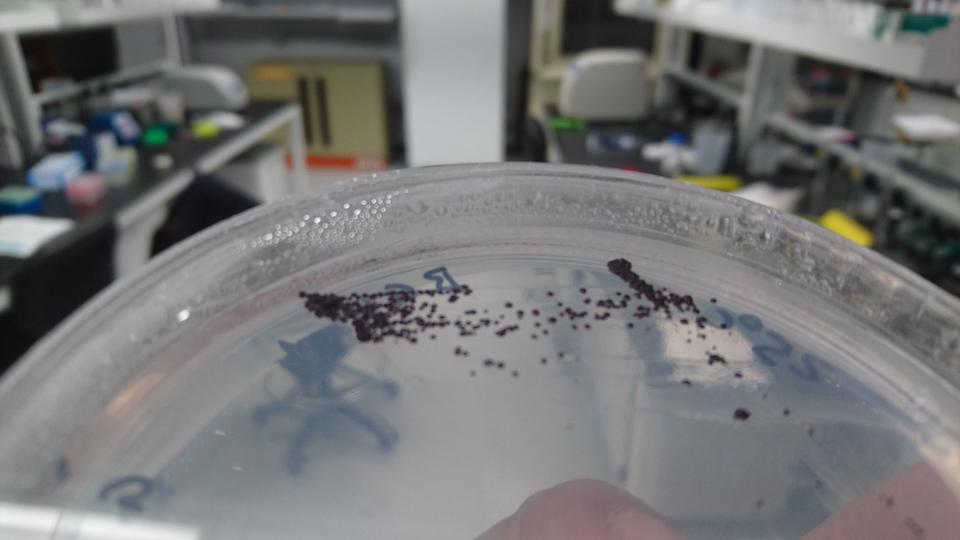

## Ongoing research projects

## Diversity and evolution of early oxygenic phototrophs

We are interested in diversity, ecology, and evolution of early oxygenic phototrophs and currently working towards acquiring them from various habitats.
Some of the lineages we are especially interested in are those that may have evolved the ability to produce oxygen gas as a byproduct of photosynthesis.
The lineages we are currently targetting include *Gloeobacter* species and closely related cyanobacteria.

We are also interested in non-photosynthetic cyanobacterial lineages from various locations. A picture below shows a phototrophic biofilm dominated by rare cyanobacterial species known as *Gloeobacter*, which was found near steam vents of Hawaii.

Gloeobacter kilaueensis</em> near a steam vent in Hawaii" title="Biofilm sample dominated by *Gloeobacter kilaueensis* near a steam vent in Hawaii">

## Microbial community assemblage in hot springs

We are interested in how microbial communities form in different hot springs and predictability of how such communities form.

We have recently collected samples from hot springs around Utah and Oregon. You can see an aerial footage of hot springs from a location in Oregon below.

<iframe src="https://player.vimeo.com/video/366172777" width="640" height="360" frameborder="0" allow="autoplay; fullscreen" allowfullscreen></iframe>

## Targeted cultivation of *Archaea* and *Bacteria* from various environments

Gloeobacter morelensis</em> on BG11" title="*Gloeobacter morelensis* on BG11">

We are interested in targeted cultivation and characterization of novel bacterial and archaeal lineages from various environments. We use a combination of cultivation, microscopy, and sequencing methods to study these lineages.

## Fieldwork

### 2019

Hawaii (The Big Island)

Utah and Oregon
